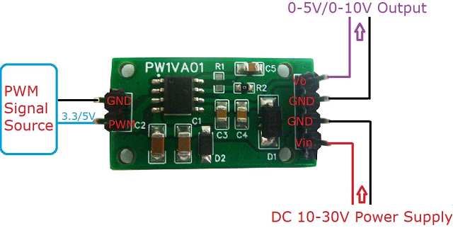

# Asistente automático para rehabilitación 

Proyecto para la materia Construcción de Sistemas de Computadora dictada en la UNTREF en el ciclo lectivo 2022

## Integrantes

 -  Alejandro Araneda (eloscurodeefeso@gmail.com)

 -  Citia Capece (cintiflor@gmail.com)

 -  Lucas Nevado (nevadolucas@gmail.com)

## Descripción de archivos

|Archivo                              |Descripción                |
|-------------------------------------|---------------------------|
android | directorio con el proyecto de MIT App INventor
arduino | directorio con el _sketch_ de Arduino
backend | directorio con los fuentes del servicio en NodeJS
doc | directorio con los fuentes de los diagramas generados
media | directorio con los rendeizados de las imágines 
proteus | directorio con el proyecto de Proteus
pruebas-de-concepto | directorio con las pruebas de concepto
README.md | Este archivo
android\caminador.aia | Proyecto de la aplicación para MIT App Inventor
arduino\arduino.ino | _Sketch_ de Arduino con el _firmware_
backend\docker-compose.yml | Archivo YAML descriptor de opciones de ejecución de Docker
backend\package.json | Archivo JSON con la descripción de comandos y dependencias de proyecto NodeJS
backend\src | Código fuente del servicio
doc\deployment.puml | Archivo de PlantUML para el Diagrama de Implantación
doc\deployment.svg | Archivo SVG del Diagrama de Implatación más íconos
doc\der.puml | Archivo DOT incrustado en PlantUML con el Diagrama de Entidad-Relación
doc\firmware.puml | Archivo de PlantUML para el Diagrama de Estados del _firmware_
doc\usecases.puml | Archivo de PlantUML para el Diagrama de Casos de Usos
proteus\proteus.pdsprj | Proyecto de Proteus con el esquemático del prototipo
pruebas-de-concepto\app-backend | Comunicación de una aplicación diseñada en MIT App Invetor con un servicio NodeJS que informa la hora mediante protocolo HTTP.
pruebas-de-concepto\bt_bidireccional | Envío desde una aplicación diseñada en MIT App Iventor de un comando por comunicación Bluetooth al puerto serie de un Arduino y recepción de la lectura analógica de un potenciómetro. Simulación en Proteus.
pruebas-de-concepto\bt_unidireccional | Envío desde una aplicación diseñada en MIT App Iventor de un comando por comunicación Bluetooth al puerto serie de un Arduino. Simulación en Proteus.

# Informe

## Índice

**[Resumen](#resumen)**

**[Introducción](#introducción)**

**[Descripción de la Práctica](#descripción-de-la-práctica)**

> [Requerimientos funcionales](#requerimientos-funcionales) 
>
> [Requerimientos no funcionales](#requerimientos-no-funcionales) 
>
> [Restricciones técnicas](#restricciones-técnicas) 
>
> [Requerimientos de integración](#requerimientos-de-integración) 

**[Alcance del proyecto](#alcance-del-proyecto)**

**[Estado del Arte](#estado-del-arte)**

> [Simposios y conferencias](#simposios-y-conferencias) 
>
> [Productos comerciales](#productos-comerciales) 

**[Recursos](#recursos)**

> [Hardware](#hardware) 
>
> [Software](#software) 

**[Diseño](#diseño)**

> [Arquitectura](#arquitectura) 
>
> [Modelo de Datos](#modelo-de-datos) 
>
> [Maquetas](#maquetas) 
>
> [Diagrama de estados](#diagrama-de-estados) 
>
> [Circuito](#circuito) 
>
> [Prototipo](#prototipo) 
>
> [Interfaz](#interfaz) 

**[Implantación](#implantación)**

> [Backend](#backend) 
>
> [AppInventor](#appinventor) 
>
> [Arduino](#arduino) 

**[Conclusiones y futuros trabajos](#conclusiones-y-futuros-trabajos)**

**[Referencias](#referencias)**

## Resumen

> El objetivo de este trabajo es el diseño y la implementación de una
> computadora que controla las funcionalidades de un caminador (entre
> ellas su motor) para lo cual utiliza como interfaz una aplicación
> ejecutándose en un dispositivo móvil.

## Introducción

Las SBC (por el inglés *Single-Board Computer*) han estado presentes en
el mercado desde la década del '70 del siglo XX aprovechando el
desarrollo en aquel entonces reciente de los microprocesadores<a id="ref_15" href="#15">[15]</a>. En
la actualidad, las computadoras de una sola placa suelen implementarse
con microcontroladores. Como sabemos, la diferencia fundamental entre
estos y aquellos no es sólo la escala (velocidad, capacidad de cómputo,
memoria direccionable, etc.) sino la presencia en los integrados de los
microcontroladores de un conjunto de periféricos como conversores
analógicos digitales, relojes de tiempo real, etc., que los transforman
en verdaderos sistemas en un chip (o *System-on-Chip*, en inglés)
simplificando el diseño de las placas así como abaratando el costo.


*Raspberry Pi como ejemplo de una SBC*

En general, las características de las conexiones terminales de un
microcontrolador son tales que le permiten vincularse a otros
componentes e integrados de la familias lógicas TTL (del inglés
*transistor-transistor logic*) o CMOS (del inglés *complementary metal
-- oxide -- semiconductor*) cuyos niveles de tensión son 5 o 3,3
voltios.


*Transistor de campo en encapsulado TO-220 (izq.) y de juntura en
encapsulado TO-92 (der.)*

Su utilización como líneas directas de potencia se ve obstaculizada
además por la poca corriente que son capaces de entregar, la que en
general no excede unas pocas decenas de miliamperios. Todo eso hace
necesario para el control de dispositivos de alta tensión o consumo, la
implementación de circuitos de potencia con líneas de tensión externas y
transistores de juntura o de campo.

Desde la introducción de los controles remotos, en especial los de
tecnología de radiación infrarroja, las interfaces de interacción humana
con los dispositivos electrónicos ha ido evolucionando contínuamente. Su
estudio e implementación desde la perspectiva informática reconoce un
hito en la demostración por Douglas Engelbart en la conferencia "Fall
Joint Computer" de 1968 en San Francisco (EE.UU) del sistema NLS
(oN-Line System) desarrollado por el centro de investigación ARC
(Augmentation Research Center) de Stanford, conocida luego como "la
madre de todas las demos".


*Teléfono móvil de Siemens con puerto IRDa (izq.) y tableta
con la aplicación StudioLive Remote de Presonus (der.)*

Así también los teléfonos móviles supieron en sus inicios poseer entre
sus características de conectividad las señales infrarrojas y teclados
como, hasta llegar a la actualidad de los teléfonos inteligentes y demás
dispositivos móviles, como tabletas o relojes, todos con la posibilidad
de conección Bluetooth o WiFi y superficies táctiles en vez de teclas.

## Descripción de la Práctica

Ante una lesión de origen neuronal que afecta la motricidad, la persona
mediante una rehabilitación se puede recuperar gradualmente. El
movimiento de la extremidad afectada contribuye a evitar o aliviar las
contracturas y a mantener el grado de movilidad de las articulaciones.
Generalmente hay que trabajar también las extremidades que no han sido
afectadas para conservar el tono muscular y la fuerza<a id="ref_1" href="#1">[1]</a>.

El uso de tecnología robótica facilita la recuperación del movimiento a
pacientes con enfermedades neurológicas, accidentes cerebrovasculares,
entre otros debido a aspectos como la adaptación de los dispositivos a
las necesidades de cada paciente, la reducción de la fatiga muscular y
del dolor, la mejora en la eficiencia terapéutica y la retroalimentación
del desempeño del paciente<a id="ref_2" href="#2">[2]</a>.

*RealWalker* es una familia de productos robóticos dedicados a la
rehabilitación de los miembros inferiores de pacientes con afecciones de
origen neuronal, lesiones en la médula espinal, o problemas físicos.
Esta tecnología le permite al paciente, dependiendo el grado de lesión,
lograr resultados que van desde una importante mejora en su calidad de
vida hasta la recuperación total del andar<a id="ref_5" href="#5">[5]</a>.
La práctica describe la construcción de la computadora que controla el
funcionamiento del motor del Realwalker, con una interfaz gráfica de
usuario implementada en un dispositivo móvil con conexión inalámbrica y
que resuelve los siguientes requerimientos:

### Requerimientos funcionales

1.  El profesional médico accederá a las estadísticas de uso del centro médico según máquina y paciente.

2.  Se registran los ejercicios de todos los usuarios.

3.  La tara de la galga será configurable al inicio del entrenamiento.

4.  Todo ejercicio posee un tiempo de duración y una velocidad del motor.

5.  La máquina será operable en modo "sin plan" indicándose los parámetros de un ejercicio.

6.  La máquina será operable en modo "con plan" indicándose una secuencia de ejercicios asociados.

7.  El peso del paciente ejercido sobre la galga antes del inicio del ejercicio se podrá monitorear para posicionar al paciente de la mejor forma.

8.  El peso del paciente ejercido sobre la galga al inicio del ejercicio será conservado.

9.  Deberá ser posible detener un ejercicio en cualquier momento, siendo dicho evento conservado.

10. Un ejercicio detenido podrá continuar.

11. El tiempo de cada ejercicio variará de entre 5 a 120 minutos.

12. El motor se utilizará con diez (10) velocidades distintas.

13. Los planes de entrenamiento deben poder conservarse.

14. Las estadísticas deberán poder enviarse por correo electrónico.

15. Las estadísticas deberán almacenarse en un servidor con acceso a Internet.

### Requerimientos no funcionales

16. El diseño será guiado por el principio de máxima agilidad en el manejo del sistema.

### Restricciones técnicas

17. La aplicación del dispositivo móvil que actúe como controlador de la máquina deberá desarrollarse mediante "MIT App Inventor" (http://ai2.appinventor.mit.edu/).

18. El dispositivo móvil que actúe como controlador de la máquina deberá conectarse de forma inalámbrica mediante Bluetooth o WiFi.

19. La velocidad del motor resultante de su control por el dispositivo SINAMICS G110 será configurada a su vez por su interfaz analógica.

### Requerimientos de integración

20. La unidad de procesamiento controlará el motor a través del dispositivo SINAMICS G110 de la empresa Siemens.

## Alcance del proyecto

La integración de este proyecto como subsistema del caminador
*Realwalker* es en realidad simulado por un prototipo cuya señal de
control hacia el motor está representada por la operación de un
ventilador de computadora; por otro lado, la recepción de la señal de
entrada de la galga conectada al arnés del paciente está representada
por un potenciómetro.



*Conversor Digital-Analógico de la empresa china *Eletechsup**.

Esta disposición de componentes representa una diferencia con respecto
al caso real, ya que la señal analógica de entrada de un potenciómetro
es mucho más estable que la de una galgas extensiométricas, salvo por
las variaciones de tensión en la alimentación; y al estar la señal
analógica necesaria para el control del SINAMICS G110 representada en
realidad por una señal digital con PWM o modulación por ancho de pulso
(del inglés, *pulse-width modulation*), es necesario la utilización de
algún módulo conversor digital-analógico para implantar esta computadora
en el caminador real.

## Estado del Arte

La problemática de controlar motores y circuitos de potencia mediante
microcontroladores y otros Systems-on-Chip, los que a su vez utilizan
como interfaz humana una aplicación de algún dispositivo móvil
inalámbrico, se encuentra abordada por distintos proyectos comerciales y
es motivo de diversas ponencias en simposios y conferencias.

### Simposios y conferencias

Relacionadas con el diseño de este proyecto desde el aspecto
tecnológico, se llama la atención sobre el trabajo relativo a un sistema
de laboratorios remotos basado en placas Raspberry y placas
Arduino<a id="ref_14" href="#14">[14]</a>. El desarrollo para la Facultad de Ingeniería de la
Universidad Nacional de Buenos Aires, se realizó en el contexto del
problema de optimización para la cursada de las prácticas de
laboratorios de Física con cursos masivos y limitados recursos de
infraestructura.


*Mesa del laboratorio remoto para experimentos de física con finalidad
educativa*

Desde la perspectiva del presente proyecto, el desarrollo de la los
alumnos de la Facultad de Ingeniería de la UBA es ilustrativo en cuanto
a las posibilidades que brindan las diversas computadoras de una sola
placa, tanto en el control de motores como en las comunicaciones
remotas.

### Productos comerciales


*Aplicación LOGO! de la empresa Siemens y Wiser Home de Schneider*

En cuanto a los productos actuales en el mercado que utilizan un
dispositivo móvil para el control de motores, es interesante distinguir
entre las aplicaciones industriales y hogareñas. Las primeras se dedican
tanto al sistema de alertas sobre el funcionamiento de maquinaria cuyos
sensores se encuentran vinculados a algún transmisor, como a la
configuración de controladores digitales de motores que pueden incluso
ya poseer un tablero de control, pero en este caso mediante una interfaz
remota.

Las aplicaciones hogareñas, en cambio, se centran principalmente en la
domótica, o tecnologías capaces de automatizar una vivienda. Siendo sus
diseños de interfaz muy relevantes para el desarrollo del presente
proyecto.

## Recursos

Los recursos elegidos para llevar a cabo el proyecto se basan en las
siguientes tecnologías:

### Hardware

**Arduino:** plataforma de electrónica abierta para la creación de
prototipos basada en hardware flexible y fácil de usar. Su arquitectura
consiste en una tarjeta con un microcontrolador que permite conectar
sensores, actuadores y otros elementos mediante sus entradas y salidas;
analógicas y digitales.


*Esquema del Arduino Uno*

### Software

**App Inventor:** es un entorno de programación visual e intuitivo que
permite a todos, incluso a los niños, crear aplicaciones totalmente
funcionales para teléfonos Android, iPhones y tabletas Android/iOS.
Aquellos que son nuevos en MIT App Inventor pueden tener una primera
aplicación simple en funcionamiento en menos de 30 minutos. Y lo que es
más, la herramienta basada en bloques facilita la creación de
aplicaciones complejas y de alto impacto en mucho menos tiempo que los
entornos de programación tradicionales. El proyecto MIT App Inventor
busca democratizar el desarrollo de software al empoderar a todas las
personas, especialmente a los jóvenes, para pasar del consumo de
tecnología a la creación de tecnología.<a id="ref_11" href="#11">[11]</a>

**Proteus:** un sistema completo de diseño electrónico que combina un
avanzado programa de captura de esquemas, un sistema de simulación mixto
(analógico y digital) basado en Spice, y un programa para disposición de
componentes en placas de circuito impreso y auto-ruteado. Se trata de un
software comercial fabricado por Labcenter Electronics <a id="ref_12" href="#12">[12]</a>,
caracterizado por su potencia y facilidad de uso.

**NodeJS**: es un entorno de programación en JavaScript para el Backend
basado en el motor V8 de JavaScript del navegador Google Chrome y
orientado a eventos<a id="ref_10" href="#10">[10]</a>, no bloqueante, lo que lo hace muy rápido a la
hora de crear servidores web y emplear tiempo real. Fue creado en 2009
por Ryan Dahl <a id="ref_7" href="#7">[7]</a> y aunque aún es joven, las últimas versiones lo
hacen muy robusto además de la gran comunidad de desarrolladores que
posee. Al contrario que la mayoría del código JavaScript, no se ejecuta
en un navegador, sino en el lado del servidor. Es posible utilizar
módulos desarrollados por terceros, ya sea como archivos ".node"
precompilados, o como archivos en javascript plano. Los módulos
Javascript se implementan siguiendo la especificación CommonJS para
módulos<a id="ref_8" href="#8">[8]</a>, utilizando una variable de exportación para dar a estos
scripts acceso a funciones y variables implementadas por los
módulos<a id="ref_9" href="#9">[9]</a>.


*Diagrama UML de los Casos de Usos.*

## Diseño 

A partir de los requerimientos relevados en la presentación del trabajo
por la cátedra al curso, y las sucesivas reuniones individuales con el
grupo, se elabora el modelo de Casos de Uso.

Considerando el diseño en cuanto subsistema del producto final, se
reconocen cuatro tipos de actores que lo utilizarán: el Asistente, el
Doctor, el Paciente y el subsistema que incluye el GS110.

En cuanto al Paciente, su interacción con el subsistema consiste
únicamente en el caso de uso de "Entrenar", un uso pasivo en nuestro
diseño del que igualmente se deja constancia ya que se debe recolectar
el peso que el Paciente ejercerá a través del sistema de arneses sobre
la galga. Mientras que por otro lado es el Asistente quien "Registra el
Paciente", "Registra el Entrenamiento" y sus pasos al "Ingresar un
Ejercicio" que formará parte del entrenamiento. También es el Asistente
quien debe "Calibrar la galga", y está a cargo de "Iniciar/detener el
Ejercicio".


*Diagrama UML de la Implantación.*

El Doctor como actor derivada del Asistente, hereda sus casos de usos
además de "Registrar al Doctor", "Autenticar al Doctor", cuestiones que
hacen a la seguridad y sensibilidad de la información debida cuenta de
la responsabilidad legal médica, y "Acceder a las estadísticas" de uso,
tanto en lo que hace al seguimiento médico del Paciente como a la
posible administración de un centro médico.

Finalmente, el subsistema que incluye al inversor GS110 de Siemens,
participa al "Entrenar" recibiendo las señales de control que producirá
la computadora.

### Arquitectura

Tomando en consideración los requerimientos técnicos se elabora una
diagrama de implantación que exprese de forma más general la
arquitectura del diseño.

La arquitectura del proyecto se compone de tres unidades de
procesamiento. En primer lugar tenemos un microcontrolador Arduino,
encargado de la comunicación con el GS110, por medio del puerto
analógico, y de la comunicación con la aplicación móvil gracias al
módulo Bluetooth HC05.

La aplicación móvil, otra de las unidades de procesamiento, se compone
de la aplicación *per se* y de una base de datos con el historial local.
Permite el control del microcontrolador a través de una conexión
Bluetooth, y asimismo se conecta mediante el protocolo HTTP/HTTPS a un
servidor para recibir y enviar los datos necesarios.

La tercera unidad de procesamiento es el servidor. Consiste de un base
de datos para guardar toda la información necesaria para el correcto
funcionamiento del proyecto y de un servicio que permite la comunicación
con la aplicación móvil.

### Modelo de Datos

La utilización de la aplicación la realizan usuarios que se pueden
loguear si ya tienen cuenta o crear cuenta nueva. Existen dos tipos de
usuarios : doctor y asistente. Los asistentes tienen acceso a los
pacientes para añadirles/quitarles los entrenamientos que deben
realizar.


*Diagrama de Entidad-Relación correspondiente al modelo de datos.*

Los doctores además tienen un manejo del sistema más abarcativo que los
asistentes, pudiendo así administrar el Centro Médico según su rol. El
Centro Médico posee asociadas una o más maquinarias.

Los pacientes pueden realizar una serie de ejercicios según la patología
y los avances reflejados en la historia clínica. Los Entrenamientos son
conjuntos de ejercicios que dependen de una modalidad y tienen asociado
un número identificatorio para ser asignados a los pacientes.

Los ejercicios tienen asociado un número identificatorio para ser
asignados a los entrenamientos y se le configura la velocidad y la
duración.

### Maquetas

En la pantalla de bienvenida se encuentran las tres secciones
principales:

a.  La sección de entrenamientos, que permite iniciar nuevos ejercicios.

b.  La sección de calibración, para calibrar los valores obtenidos de la
    > galga.

c.  La sección de estadísticas, permite ver un resumen de estadísticas.


*Maquetas de las distintas pantallas de la aplicación móvil*

En la sección de entrenamientos la primera pantalla que se presenta
contiene un selector de pacientes, con la lista correspondiente a quien
esté operando el sistema, un monitor de peso, botones de selección de
entrenamiento libre o programado, y los últimos botones para iniciar o
detener el entrenamiento.

Al ingresar a la pantalla de entrenamiento programado la siguiente
pantalla muestra la posibilidad de selección de entrenamientos
precargados, y en caso de crear uno nuevo permite agregar los pasos
definiendo la duración y velocidad de cada uno.

Por último, desde la pantalla de calibración se permite fijar la tara e
ingresar nuestro peso de referencia, para luego guardar esos valores y
calibrar correctamente los datos obtenidos desde la galga.

### Diagrama de estados

Tomando en consideración la cumplimentación de los casos de usos y las
fases de desarrollo de las historias de usuario a través de la interfaz
gráfica, se definen los distintos estados por los que pasa el
dispositivo correspondiente a la unidad de procesamiento, de forma tal
de modularizar y comprender el *firmware* implantado.

El estado **"*Init*"** corresponde a la inicialización del dispositivo,
en particular la funcionalidad de las entradas/salidas y los módulos del
SoC. Sin necesidad del ingreso de un comando o el suceso de un evento
temporal, cumplidas las tareas correspondientes a este estado se pasa al
de "*Idle*".

En el estado de **"*Idle*"** el dispositivo verifica el estado de las
comunicaciones, y las restablece en caso de ser necesario. Cumplida
estas tareas queda en estado de espera de un comando de parte de la
aplicación móvil. Éste será a su vez el estado de funcionalidad
reconocida al que volverá el firmware en caso de producirse cualquier
evento de error en los demás.

El estado denominado como **"*Config*"** sirve a los efectos de
encapsular la espera de comandos que configuren algún parámetro de
funcionamiento como así también el informar el resultado de sensar el
peso que el paciente ejerce sobre la galga a través del arnés de
entrenamiento.


*Diagrama UML de Estados para el desarrollo del* firmware.

En el estado **"*Getset*"** el dispositivo queda a la espera de recibir
los distintos ejercicios que formarán los pasos del entrenamiento. Luego
en el estado "*Ready*" la unidad de procesamiento informará de forma
contínua acerca del peso ejercido por del paciente y quedará a la espera
de la orden de iniciar el entrenamiento.

Los estados de **"*Run*"** y **"*Pause*"** corresponden respectivamente
a la funcionalidad de ejecutar el plan de entrenamiento y de detenerlo
(conservando el punto de retorno al mismo). Las transiciones entre
estados corresponden a la recepción de los comandos "begin_program",
"end_program", "begin_config", "end_config", "discard", "run",
"continue" y "pause", lo mismo que por los eventos de evento completado
("completed").

### Circuito 

El circuito está compuesto por: 4 Resistencias de 1 kOhms (R1), 10 kOhms
(R4), 220 Ohms (R3) y 220 kOhms (R5); 1 potenciómetro (RV1); 2 Diodos (1
Diodo led); 1 Transistor MOSFET (Q1); 1 Switch (HARD STOP); el módulo
Bluetooth (HC1); el módulo Arduino (SIM1); y el motor del ventilador.


*Esquemático del circuito implementado en el prototipo*

Para la implementación del circuito del prototipo es necesario la
utilización de dos rieles de alimentación, uno a 5 voltios para el
potenciómetro y para el módulo Bluetooth, y otro a 12 voltios para el
módulo Arduino y para el motor del ventilador.

Como es habitual, se colocan resistores en configuración *pull-down* a
los efectos de estabilizar la señales provenientes desde el interruptor
(R4) y la que controla la puerta del transistor (R5). También se colocan
resistores limitantes de corriente tanto en la señal que activa el diodo
LED (R3) como en la que activa la puerta del transistor (R1).

### Prototipo

El prototipo se diseñó primeramente en 3D tomando en cuenta las medidas
reales de los componentes y pensando la mejores ubicaciones para
maximizar la comodidad del ensamblado así como la robustez.


*Modelado del prototipo en 3D previo a su construcción*

Tanto la placa Arduino como el ventilador se atornillan a la caja que
sirve de contenedor al *protoboard,* el cual tiene conectados y pegados
los componentes electrónicos.

### Interfaz

El servicio que brinda el backend para que la app se pueda conectar,
utiliza peticiones HTTP que impactan en procesamientos realizados por
las capas intermedias y las capas de acceso a la base de datos.


*Estructura del Backend*

Las capas intermedias se encargan de generar toda la estructura para
poder definir el modelo de datos, configurar el servidor, manejar los
errores que puedan surgir. Dichas capas, estáticamente se distribuyen
en:

-   **config:** configuraciones pertinentes

-   **routes**: definición de las rutas correspondientes

-   **controllers:** conjunto de funcionalidades

-   **services:** utilización de los métodos del dao

-   **models:** los modelos que se representan en la base de datos

-   **dtos:** recurso para asignar los atributos del modelo

-   **assemblers:** funciones utilizadas para crear los modelos

-   **filters:** creación de filtros para realizar búsquedas en la base de datos

Y la capa de acceso se denomina **dao** y es la encargada de la
interacción directa con la base de datos. Para realizar operaciones en
la base de datos, internamente se crea una estructura ABM
(Alta-Baja-Modificación) por cada entidad del modelo de datos. Y
externamente, la app las consume mediante una api definida por:

***Alta de una entidad***

```
POST http://localhost:3800/<entidad >

BODY (Formato JSON) :

{

"campo_entidad": "valor_campo_entidad"
.........................
"campo_n_entidad": "valor_n_campo_entidad"

}
```

***Modificación de una entidad***

```
PUT http://localhost:3800/<entidad>/<idEntidad>

BODY (Formato JSON):

{

"campo_entidad": "valor_modificado_campo_entidad"

> .........................

"campo_n_entidad": "valor_modificado_n_campo_entidad"

}
```

***Baja de una entidad***

```
DELETE http://localhost:3800/<entidad>/<idEntidad>
```

Además, la api expone los siguientes endpoints para el manejo del módulo
AUTH , el cual abarca la autenticación y la autorización de usuarios:

***Para creación de usuarios***

```
POST a localhost:3800/auth

BODY (Formato JSON) :

{

"username":"masdediezcaracteres",

"password":"masdediezcaracteres"

}
```

*Observación*: La password debe tener más de diez caracteres
y tanto el username como la password deben ser alfanuméricos.

***Para Login***

```
POST a localhost:3800/auth/login

BODY (Formato JSON)

{

"username":"masdediezcaracteres",

"password":"masdediezcaracteres"

}
```

*Observación*: Si los datos son incorrectos : status 401

***Ver Usuarios***

```
GET a localhost:3800/auth
```

Muestra el listado de usuarios en Formato JSON.

***Ver un Usuario Específico***

```
GET a localhost:3800/auth/#idusuario
```

Muestra un usuario específico en Formato JSON.

***Modificar un Usuario Específic***o
```
PUT a localhost:3800/auth/#idusuario

BODY (Formato JSON)

{ "username":"modificacion",

"password":"modificacion"

}
```
*Observación*: Se puede modificar el username y/o la
contraseña

Consideraciones generales de la api:

-   El sistema por default debería devolver el mensaje "Éxito". Existe
     la posibilidad de customizar el mensaje dependiendo de la acción
     del servicio.

-   Por default, el servicio se levanta en http://localhost:3800 pero
     eventualmente existe la posibilidad de publicarlo enmascarado en
     otra url.

## Implantación

### Backend

El servicio se implanta contenerizado: el backend y la api en el
contenedor Caminador-Cli, y la base de datos en el contenedor MongoDB.


*Estructura del Backend Dockerizada*

Por ende, se ejecutan los siguientes pasos para inicializar el servicio
:

1)  Ubicarse en la carpeta raíz donde se encuentra el archivo
     docker-compose.yml y ejecutar:
```
$ docker-compose up -d
```
2)  Ejecutar por consola:
```
$ docker exec -it caminador bash
```
3)  Una vez dentro del contenedor, para inicializar el backend ejecutar
     el siguiente comando:
```
 $ npm install
 $ npm start
```
### AppInventor

1)  Clonar el repositorio:
```
$ git clone https://github.com/HeraclitoDeEfeso/caminador
```
2)  Dirigirse hacia http://ai2.appinventor.mit.edu/ y loguearse con el
     email.

### Arduino

El *firmware* se compila utilizando el mismo entorno de programación
ofrecido por el proyecto Arduino. Se utiliza una librería externa para
la implementación de la máquina de estados, a los efectos de reducir el
tiempo de pruebas ya que la misma es ampliamente utilizada por la
comunidad.

## Conclusiones y futuros trabajos

El desarrollo del presente proyecto ofrece diversas oportunidades para
que el alumno de Ingeniería en Computación pueda poner en práctica las
aptitudes adquiridas tanto durante la cursada de la materia como en el
conjunto de la carrera. Las entregas parciales fechadas permiten poner
en juego la capacidad de planificación, de la misma forma que la
subdivisión de tareas entre los integrantes del grupo.

Las diversas etapas del proyecto desde la obtención de los
requerimientos hasta la demostración final del producto, así mismo como
las diversas tecnologías utilizadas, obligan a cada miembro del grupo a
completar sus conocimientos, tanto sobre las metodologías de trabajo
(construcción de mapas de historias de usuarios, maquetado rápido de
interfaces de usuario, etc.) como en las diversas tecnologías y modelos
de representación.


*Fotos final del prototipo implementado*

En cuanto a los aspectos específicos podemos señalar que el MIT App
Inventor resulta un entorno de programación adecuado para aquellos
iniciantes en la materia, pero engorroso para las actuales prácticas
(versionado de código fuente, etc.). Una limitación muy concreta como la
imposibilidad de mantener la conexión por Bluetooth en distintas
pantallas, obliga al diseño de un sistemas de pantallas *ad hoc*
modelado como una pila de llamadas a procedimientos que visibilizan o
invisibilizan un conjunto de componentes.

Finalmente, a pesar de que es común señalar las dificultades que
introduce la simulación en los diseños, en especial los de *hardware* y
de *software*, es posible protestar en contrario cuando así lo exige
dinamizar las pruebas de integración entre las distintas unidades de
procesamiento de la arquitectura así como las pruebas de punta a punta
que verifican cualquier nueva característica agregada, previa a su
implementación en el único prototipo.

## Referencias

<a id="1" href="#ref_1">[1]</a> PORTUGAL, Salvador E. *"Rehabilitación después de una lesión
cerebral - Fundamentos"*. Recuperado el 5 de mayo de 2022 de
https://www.msdmanuals.com/es-ar/hogar/fundamentos/rehabilitaci%C3%B3n/rehabilitaci%C3%B3n-despu%C3%A9s-de-una-lesi%C3%B3n-cerebral

<a id="2" href="#ref_2">[2]</a> *"Tecnología Robótica Facilita La Rehabilitación De Personas Con
Discapacidad".* Recuperado el 5 de mayo de 2022 de
http://www.mobilitygroup.co/mobility/blog/tecnologia-robotica-facilita-la-rehabilitacion-de-/

<a id="5" href="#ref_5">[5]</a> *"REALWALKER. Rehabilitación Robótica".* Recuperado el 5 de mayo
de 2022 de http://www.realwalker.com.ar/index.php/es/productos/

<a id="7" href="#ref_7">[7]</a> ALEX HANDY (24-06-2011).*"Node.js pushes JavaScript to the
server-side"*.SDTimes.

<a id="8" href="#ref_8">[8]</a> *"CommonJS Implementations"*. Consultado el 15 de mayo de 2011.
Disponible en: http://www.commonjs.org/impl/

<a id="9" href="#ref_9">[9]</a> RYSWYCK (2011).*"Taking Baby Steps with Node.js -- CommonJS and
Creating Custom Modules"*. Disponible en:
[http://elegantcode.com/2011/02/04/takingbaby-steps-with-node-js-commonjs-and-creating-custom-modules/](http://elegantcode.com/2011/02/04/takingbaby-steps-with-node-js-commonjs-and-creating-custom-modules/)

<a id="10" href="#ref_10">[10]</a> GONZÁLEZ LABARTA. (2014). "*Javascript Sean Stack: Una Mirada Al
Futuro Del Desarrollo Web"*. XII Jornada Científica Estudiantil
(Universidad de las Ciencias Informáticas, Cuba). Disponible en
https://www.researchgate.net/publication/261988203

<a id="11" href="#ref_11">[11]</a> *"MIT App Inventor. About us.".* Recuperado el 7 de mayo de 2022
de https://appinventor.mit.edu/about-us

<a id="12" href="#ref_12">[12]</a> Labcenter Electronics (http://www.labcenter.co.uk)

<a id="14" href="#ref_14">[14]</a> VILLAFAÑE, BRUMOVSKY & AVELEYRA (2019). *"Sistema de Laboratorios
Remotos basado en una plataforma Raspberry/Arduino"*. I Congreso
Internacional de Ingeniería Aplicada a la Innovación y Educación y
Asamblea General de ISTEC

<a id="15" href="#ref_15">[15]</a> GRIGSON & HARRIS (1983). *"Marvin - Z80 Control Computer"*.
Revista "Electronics Today International", número de Agosto--Octubre de
1983.
